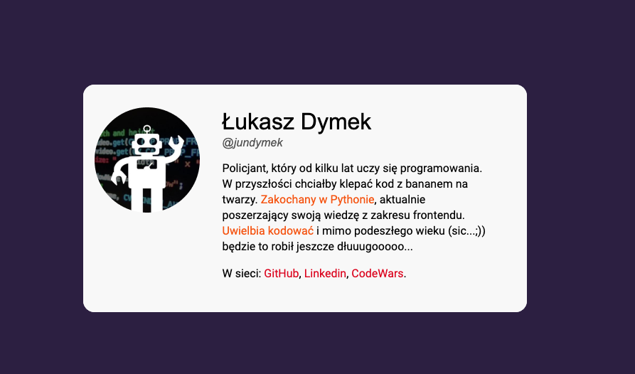

# Personal card.

It is another homework from [WTF](https://cotenfrontend.pl) frontend course.

It is simple card written in pure html, css.  

Tehnologies and tools used in this project 🚀:
- HTML5
- CSS3 
    - flexbox
- JS
- Visual Studio Code
- Figma (layout design)
- GIT

